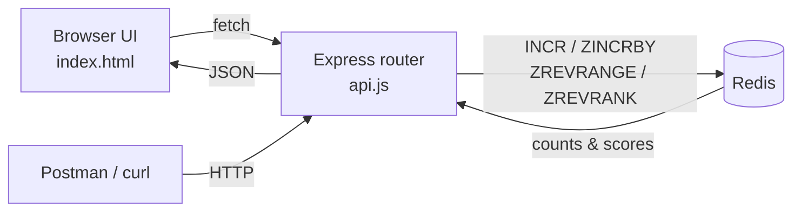

# Live LeaderBoard (Redis Counters & Sorted Sets)

## Project Overview

The **Live LeaderBoard** is a small, self-contained feature inside the `Redis-JavaScript`
learning project. Its goal is to demonstrate — with real, runnable code — how Redis solves
two classic "real-time ranking" problems that are awkward and slow in a traditional
relational database:

1. **Counting things fast** (e.g. how many times a post was viewed) using an **atomic
   counter** (`INCR`).
2. **Keeping an always-sorted ranking** (e.g. top players by score) using a **Sorted Set**
   (`ZINCRBY` / `ZREVRANGE` / `ZREVRANK`).

Both patterns update and read data in **memory**, in a **single atomic command**, so they
stay correct and fast even when thousands of requests hit at the same time.

### Why not a normal database?

To increment a counter in SQL you typically run `SELECT value → UPDATE value = value + 1`,
which needs **row locking** and a **transaction** so two simultaneous requests don't read the
same number and both write `+1` (a lost update). Building a leaderboard means an
`ORDER BY score DESC LIMIT 10` query that re-sorts the table on every read. Redis removes
both problems:

| Problem | Relational DB | Redis |
| --- | --- | --- |
| Increment a counter | `SELECT` → `UPDATE` + lock + transaction | `INCR` (one atomic command) |
| Get top-N ranking | `ORDER BY ... LIMIT` (re-sorts each read) | `ZREVRANGE` (set stays sorted) |
| Find one user's rank | Count rows with a higher score | `ZREVRANK` (O(log N)) |

### What's in the box

| Piece | File | Responsibility |
| --- | --- | --- |
| **HTTP API** | [../src/liveLeaderBoard/api.js](../src/liveLeaderBoard/api.js) | Express router exposing the 4 endpoints |
| **Interactive UI** | [../src/liveLeaderBoard/index.html](../src/liveLeaderBoard/index.html) | Slate + sage dashboard to try every endpoint live |
| **Wiring** | [../src/index.js](../src/index.js) | Mounts the router at `/` and serves the UI as a static page |

### How it fits the app

In [../src/index.js](../src/index.js) the feature is registered with two lines:

```js
app.use(express.static(path.join(__dirname, 'liveLeaderBoard'))); // serves index.html at /
app.use('/', leaderboardRouter(redis));                            // mounts the 4 endpoints
```

The router is given the shared `ioredis` client (`new Redis(process.env.REDIS_URL || 'redis://localhost:6379')`),
so it reuses the same Redis connection as the rest of the project.

## Architecture at a glance



## Data model (Redis keys)

The whole feature stores state in just two kinds of keys:

- `post:views:{id}` — a **string counter** per post. `INCR` bumps it by 1 on every view.
  Example: `post:views:42 = 3`.
- `leaderboard` — a single **sorted set** where each *member* is a `userId` and its *score*
  is that user's points. Redis keeps members ordered by score automatically.

## Request lifecycle example

Awarding points to `alice`:

1. Client sends `POST /leaderboard/score` with `{ "userId": "alice", "points": 10 }`.
2. Router validates `userId` is present and `points` is a number.
3. Redis runs `ZINCRBY leaderboard 10 alice` → returns the new score (e.g. `30`).
4. The set is now re-ordered instantly, so the next `GET /leaderboard` reflects it.
5. API responds `{ "userId": "alice", "score": 30 }`.

## Concept

| Command | What it does | Used for |
| --- | --- | --- |
| `INCR` | Atomically increments a string counter | Post view counts |
| `ZINCRBY` | Adds points to a member's score in a sorted set (creates it if missing) | Awarding score to a user |
| `ZREVRANGE` | Reads members ordered by score, highest first | Top-N leaderboard |
| `ZREVRANK` | Returns a member's 0-based position, highest score first | A user's rank |

### Redis keys

- `post:views:{id}` — string counter incremented with `INCR`
- `leaderboard` — sorted set updated with `ZINCRBY`, read with `ZREVRANGE` / `ZREVRANK`

## Endpoints

### `POST /:id/view`

Increment the view count of a post (`INCR`).

- Response:

```json
{ "postId": "42", "views": 3 }
```

### `POST /leaderboard/score`

Add points to a user's score (`ZINCRBY`). Creates the user on the leaderboard if new.

- Body:

```json
{ "userId": "alice", "points": 10 }
```

`points` defaults to `1` when omitted. Returns `400` if `userId` is missing or `points` is not a number.

- Response:

```json
{ "userId": "alice", "score": 10 }
```

### `GET /leaderboard`

Get the top 10 leaders, highest score first (`ZREVRANGE ... WITHSCORES`).

- Response:

```json
{
  "leaders": [
    { "rank": 1, "userId": "alice", "score": 30 },
    { "rank": 2, "userId": "bob", "score": 15 }
  ]
}
```

### `GET /leaderboard/:userId/rank`

Get a single user's rank (`ZREVRANK`). Rank is **1-based** in the response. Returns `404` if the user is not on the leaderboard.

- Response:

```json
{ "userId": "alice", "rank": 1, "score": 30 }
```

## Tech stack

- **Node.js + Express 5** — HTTP server and routing.
- **ioredis** — Redis client used for all `INCR` / `ZINCRBY` / `ZREVRANGE` / `ZREVRANK` calls.
- **Redis** — in-memory data store (string counters + sorted set).
- **Vanilla HTML/CSS/JS** — zero-dependency interactive UI (`index.html`) served as a static file.

## Getting started

Prerequisites: **Node.js** installed and a **Redis** server reachable at
`redis://localhost:6379` (override with the `REDIS_URL` env var). The repo ships a
`docker-compose.yml` if you want Redis in a container.

```bash
npm install      # install dependencies
npm run dev      # start the server (nodemon) on port 3000
```

Then open http://localhost:3000/ for the UI, or use the curl commands below.

## Interactive UI

Open http://localhost:3000/ after starting the server. The page (served from `src/liveLeaderBoard/index.html`) has controls for every endpoint and a live top-10 table, styled with a slate + sage/saga theme. Adding a score refreshes the leaderboard automatically, and the top three ranks are highlighted with medal colors.

```bash
npm run dev
```

## curl / Postman

```bash
# Increment view count of a post (INCR)
curl -X POST http://localhost:3000/42/view

# Add points to a user score (ZINCRBY)
curl -X POST http://localhost:3000/leaderboard/score \
  -H "Content-Type: application/json" \
  -d '{ "userId": "alice", "points": 10 }'

# Get top 10 leaders (ZREVRANGE)
curl http://localhost:3000/leaderboard

# Get the rank of a user (ZREVRANK)
curl http://localhost:3000/leaderboard/alice/rank
```

## Summary

The Live LeaderBoard is a compact but complete example of using Redis for real-time
counting and ranking. With four endpoints and two key patterns it shows how `INCR` and
Sorted Sets replace lock-heavy SQL counters and repeated `ORDER BY` queries — delivering
correct, low-latency results under concurrency. The bundled UI makes each Redis command
observable so the behavior is easy to understand and demo.